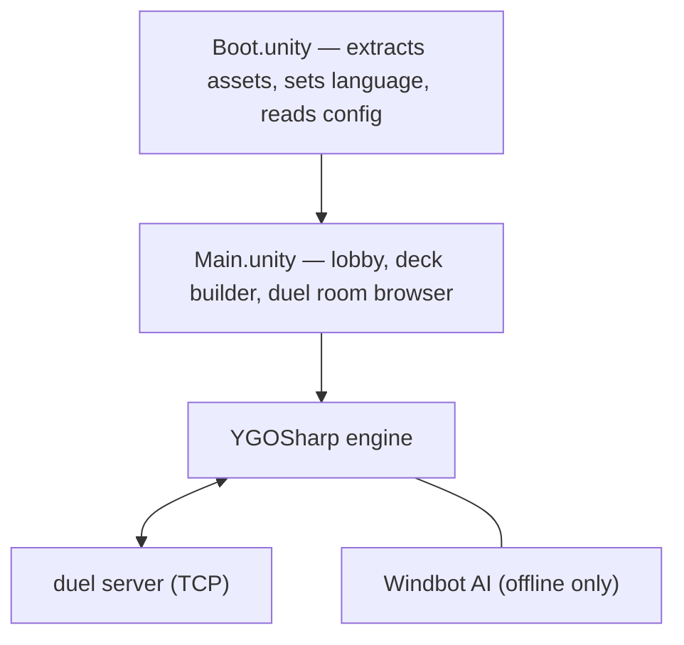

# MDPro3

A fan-made Yu-Gi-Oh! Trading Card Game simulator for mobile and desktop, built in Unity.
It uses assets extracted from Konami's official Master Duel game for a good visual experience.

## Fork goals

This fork targets **offline-only, human vs AI** use on Android.

- **Screen shake disabled**: `CameraManager.cs` `ShakeCamera()` is now a no-op.
  The original code had a DOTween lifecycle bug where rapid attacks could leave the camera
  at the wrong vertical position.

- **Performance / heat reduction**:
  - Change imported textures in the Unity Editor to ASTC 6x6 compression for the Android
    platform override (`Assets/Texture/` and `Assets/MasterDuel/`). One-time build setting,
    reduces GPU memory and heat significantly.
  - In-game settings already expose FPS cap (30 recommended), render scale (0.5 default),
    shadow quality, MSAA, and post-process AA. Keep these at their mobile defaults.

- **Disable all online features**: remove or stub out login, matchmaking, live spectating,
  deck cloud sync, and WebSocket duel server connections. The goal is a self-contained APK
  that does not require any network access.

## Platform

Built with **Unity 6000.0.10f1**. Targets Android, iOS, PC, and macOS.

## Network services used

| Service                | Purpose                              |
|------------------------|--------------------------------------|
| `sapi.moecube.com`     | MyCard account login and user data   |
| `tiramisu.moenext.com` | Duel game server (TCP + WebSocket)   |
| `cdntx.moecube.com`    | App metadata and ban-list updates    |
| `cdn02.moecube.com`    | Game asset and data downloads        |
| `rarnu.xyz`            | Deck cloud sync                      |
| `github.com`           | Community translation pack downloads |

## Architecture overview



Key script areas under `Assets/Scripts/`:

- `MDPro3/Net/` — all HTTP and WebSocket communication
- `MDPro3/Duel/` — duel UI and game-state management
- `YGOSharp/` — Yu-Gi-Oh! rules engine and network protocol
- `MasterDuel/` — Konami asset loaders (extracted from Master Duel)
- `Windbot/` — offline AI opponent

## Additional required assets (not in this repo)

See [origin_README.md](origin_README.md) for links to the platform bundles, card art,
closeup images, and sound packs required to build and run the project.

## Building the Android APK (Windows, first time)

### Step 1: Install Git

1. Download Git from https://git-scm.com/download/win and run the installer.
2. Leave all options at their defaults and click Next through to Finish.
3. Open **Command Prompt** (press `Win+R`, type `cmd`, press Enter) and verify:
   ```
   git --version
   ```

### Step 2: Install Unity Hub

Unity Hub is the launcher that manages Unity versions and projects.

1. Download Unity Hub from https://unity.com/download and run the installer.
2. Open Unity Hub after installation and sign in with a free Unity account
   (create one at https://id.unity.com if you don't have one).
3. In Unity Hub: go to **Preferences > Licenses** and activate a free Personal license.

### Step 3: Install Unity 6000.0.10f1 with Android support

The project requires this exact Unity version. A different version may fail to open it.

1. In Unity Hub, click **Installs > Install Editor**.
2. Click **Archive** tab, then **download archive** link —
   this opens the Unity download archive in your browser.
3. Find **Unity 6** in the list, locate version **6000.0.10f1**,
   and click the **Unity Hub** button next to it.
4. Unity Hub will open an install dialog. Under **Add modules**, check:

- **Android Build Support**
- Inside it, also check **Android SDK & NDK Tools** and **OpenJDK**

5. Click **Install** and wait (this downloads ~5-8 GB).

### Step 4: Clone this repo and the required asset repos

Open Command Prompt in the folder where you want to store the project, then run:

```bash
# Clone this repo
git clone https://github.com/daominah/mdpro3fork.git

# Clone required asset repos into sibling folders
git -c http.version=HTTP/1.1 clone --depth=1 https://code.moenext.com/mycard/ygopro2-closeup.git  # 80 MB
git -c http.version=HTTP/1.1 clone --depth=1 https://code.moenext.com/mycard/hd-arts.git          # 230 MB
git -c http.version=HTTP/1.1 clone --depth=1 https://code.moenext.com/mycard/mdpro3-sound.git     # 1.3 GB
# configs try to avoid Git clone failure on HTTP/2 for large repos                                # 15 GB
git -c http.version=HTTP/1.1 -c core.compression=0 clone --depth=1 https://code.moenext.com/sherry_chaos/mdpro3-assetbundles.git
```

These repos are large (several GB total). Let them finish before continuing.

### Step 5: Open the project in Unity

1. In Unity Hub, click **Projects > Add > Add project from disk**.
2. Browse to the `mdpro3fork` folder you cloned and click **Add Project**.
3. Make sure the Editor version shown next to the project is **6000.0.10f1**.
   If it shows a different version, click the version dropdown and switch it.
4. Click the project to open it. The first open takes 10-20 minutes as Unity imports assets.
   Ignore any warnings in the Console window — errors about missing asset bundles are normal
   until the sibling repos are in the correct location.

### Step 6: Build the APK

1. In Unity, go to **File > Build Settings**.
2. Select **Android** in the platform list and click **Switch Platform**
   (this re-imports assets for Android — may take several minutes).
3. Click **Player Settings** (bottom left) and check:

- **Company Name** and **Product Name**: set to whatever you like
- **Minimum API Level**: Android 7.0 (API 24) or higher recommended

4. Back in Build Settings, click **Build**.
5. Choose a folder for the output and confirm. Unity will produce an `.apk` file.
6. Transfer the APK to your Android phone and install it
   (you may need to enable **Install unknown apps** in Android settings first).

### Troubleshooting

| Problem                                    | Fix                                                                                                   |
|--------------------------------------------|-------------------------------------------------------------------------------------------------------|
| "Unity version not found"                  | Make sure you installed exactly 6000.0.10f1 via the archive                                           |
| Build fails with SDK error                 | In Unity: **Edit > Preferences > External Tools**, check "Android SDK Tools Installed with Unity Hub" |
| APK installs but game is missing cards/art | The sibling asset repos must be cloned and in the right location next to `mdpro3fork`                 |
| Phone says "App not installed"             | Enable "Install from unknown sources" in Android Settings > Security                                  |

## Syncing upstream commits from origin

This fork's git history was rewritten with `git filter-repo` to remove large font assets
that exceeded GitHub's 100 MB file limit. As a result, `git pull` from origin no longer
works. Use cherry-pick instead:

```bash
# 1. Fetch without merging
git fetch origin

# 2. Cherry-pick only the new commits
#    Replace the SHA below with the last origin commit you synced
git cherry-pick afb3a4ac7a5b30d581eb60aec563179d60074361..origin/master

# 3. If any new commit introduces large Assets/Fonts/*.asset files, strip them:
python -m git_filter_repo --path-glob "Assets/Fonts/*.asset" --invert-paths --force

# 4. Push to your GitHub fork
git push daominah master --force
```

The SHA `afb3a4ac` is the sync anchor: the last upstream commit included in this fork
before the history rewrite. Update it to the tip of `origin/master` after each sync.

## Contributing

- **Translations**: edit via the community Google Sheet (link in origin_README.md)
- **Bot config**: sync `bot.conf` from the YGOMobile repo (link in origin_README.md)
